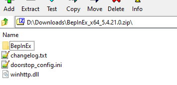
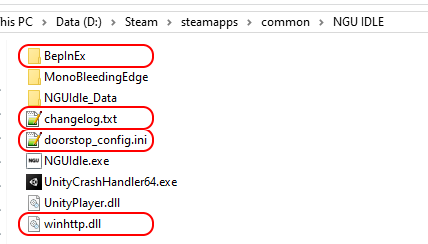

# jshepler.ngu.framerate
A mod that adds support for command line arguments (launch options in steam) to set framerate options. These are mutually exclusive - only set one of them.

## target frame rate
Add `-targetFrameRate [rate]` to specify the max FPS the game will run at. ***This disables vSync***

Example: `-targetFrameRate 120`.

This sets the unity setting: https://docs.unity3d.com/2019.4/Documentation/ScriptReference/Application-targetFrameRate.html

By default, the game uses the default value of -1 for this setting.

## vSync count
Add `-vSyncCount [count]` to specify how many frames to sync at. ***Causes targetFrameRate to be ignored***

Example: `-vSyncCount 1`

This sets the unity setting: https://docs.unity3d.com/2019.4/Documentation/ScriptReference/QualitySettings-vSyncCount.html

By default, the game sets the value of 1.

# installation
As with my [mod pack](https://github.com/jshepler/jshepler.ngu.mods), this mod uses [BepinEx](https://github.com/BepInEx/BepInEx) v5.4.21. If you don't already have BepinEx installed, download the `BepInEx_x64_5.4.21.0.zip` file from [that release](https://github.com/BepInEx/BepInEx/releases/tag/v5.4.21).

Extract the contents of the zip file

to NGU Idle's game folder `...\Steam\steamapps\common\NGU IDLE`.

If this is the first time installing BepinEx for this game, you'll need to start the game once for BepinEx to set itself up and create needed folders and config file.

Download the `jshepler.ngu.framerate.dll` file from the [latest release](https://github.com/jshepler/jshepler.ngu.framerate/releases/latest) and put it in the BepinEx\plugins folder, `...\Steam\steamapps\common\NGU IDLE\BepinEx\plugins`.
